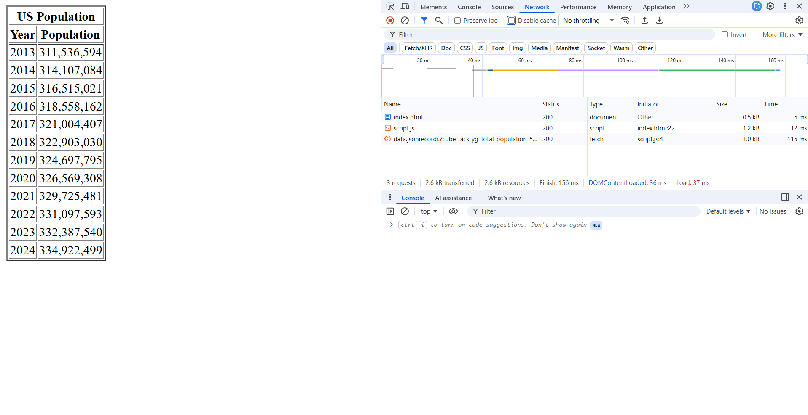

# Assignment 2: Assignment 2: API, JSON, HTML, JavaScript

The HTML page that accompanies the files in this folder displays the US Population data taken from [Data USA](https://datausa.io/about/api/).

The HTML page can be named as index.html. Upon page load, the US Population data is retrieved from an API endpoint. Then the data is parsed, sorted, and properly displayed in a table. The following screen recording shows an example result.

Using the given API endpoint,

The ```echo.py``` file aims to mimic a real-world echo. Given inputs ```text``` (a string) and ```repetitions``` (an int), the mountain will echo ```text``` a ```repetitions``` number of times.

The screenshot below shows the final HTML page.


