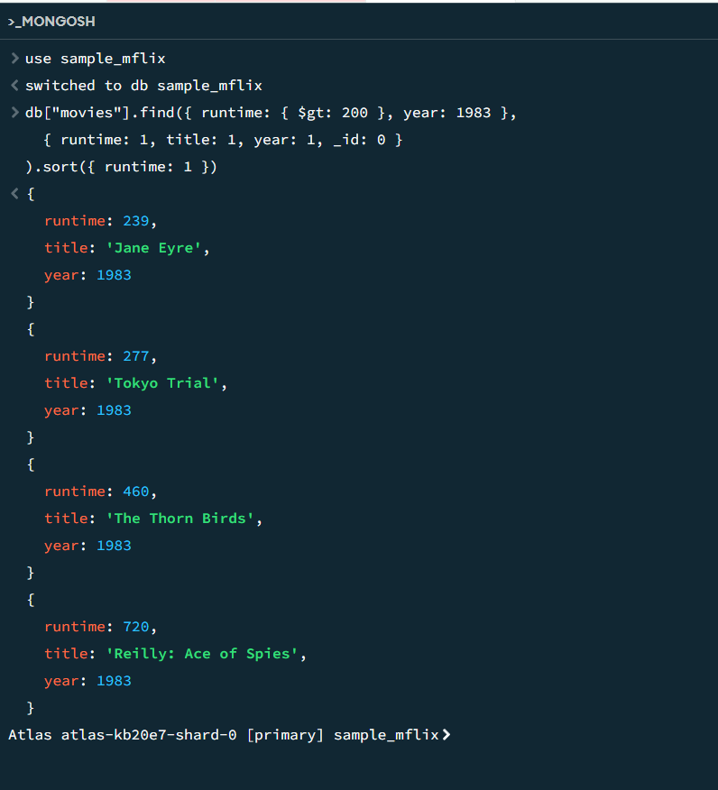
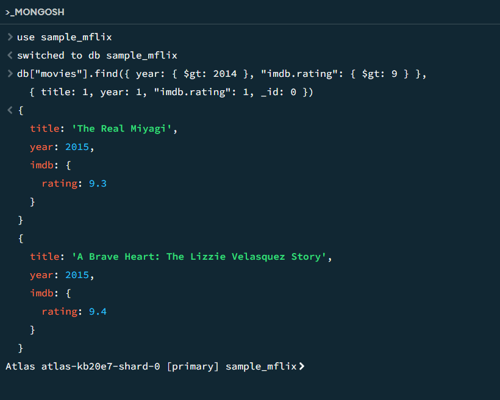

# Assignment 3: MongoDB Setup and Queries

This assignment involves signing up for MongoDB Atlas, installing MongoDB Community Edition, and running queries using MongoDB Compass for the ```sample_mflix``` dataset.

## Query 1

**Task:** Find all movies with ```runtime``` greater than 200 minutes in ```year``` 1983. The result should include a list of objects sorted by ```runtime``` increasing, and each object only has three fields: ```runtime```, ```title```, ```year```

**Query:**
```js
db.movies.find(
  { runtime: { $gt: 200 }, year: 1983 },
  { runtime: 1, title: 1, year: 1, _id: 0 }
).sort({ runtime: 1 })
```

**Result:**



## Query 2

**Task:** Find all movies after ```year``` 2014 with ```imdb rating``` greater than 9.

**Query:**
```js
db.movies.find(
  { year: { $gt: 2014 }, "imdb.rating": { $gt: 9 } },
  { title: 1, year: 1, "imdb.rating": 1, _id: 0 }
)
```

**Result:**


