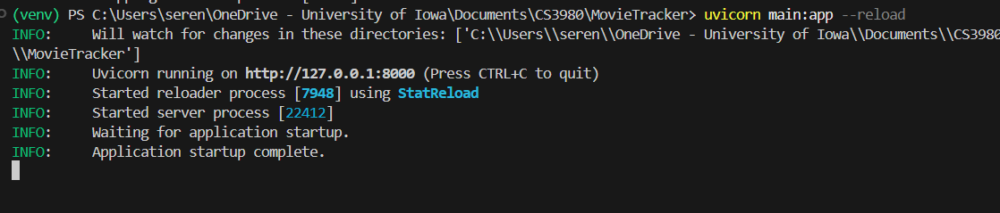
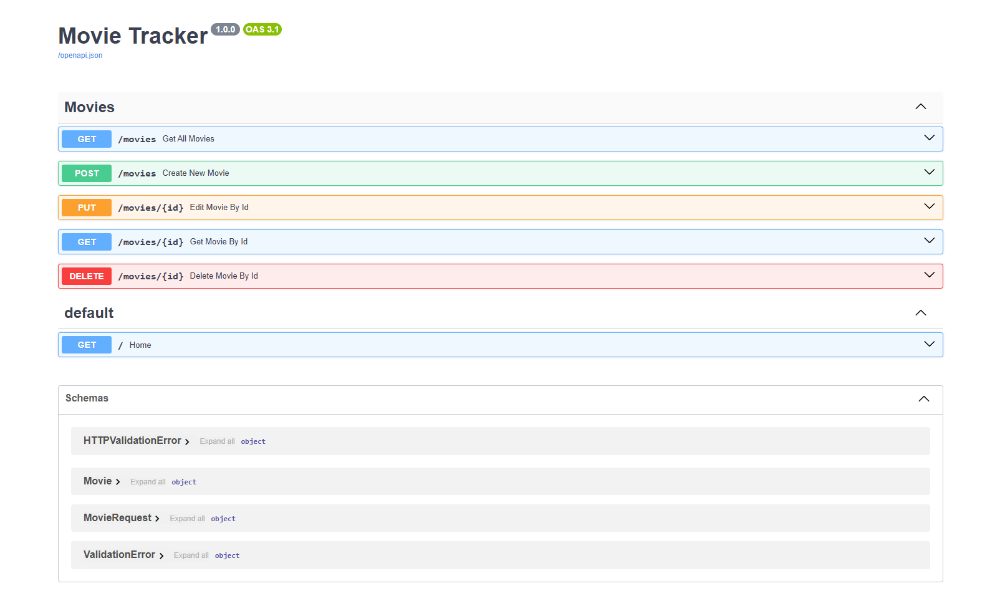
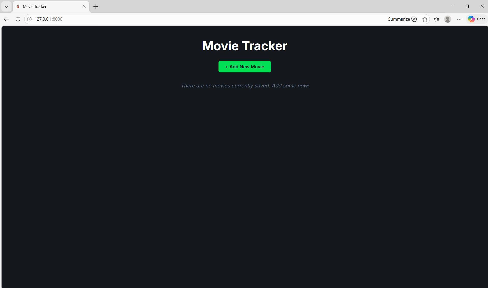
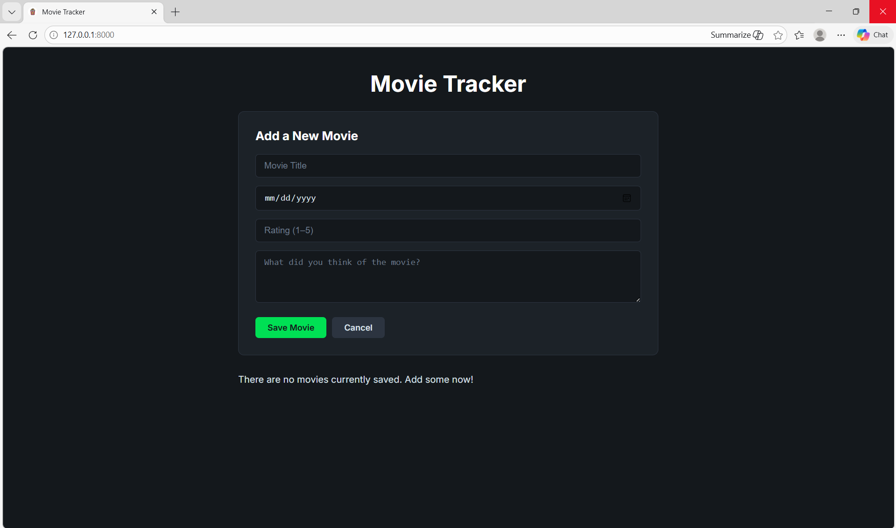
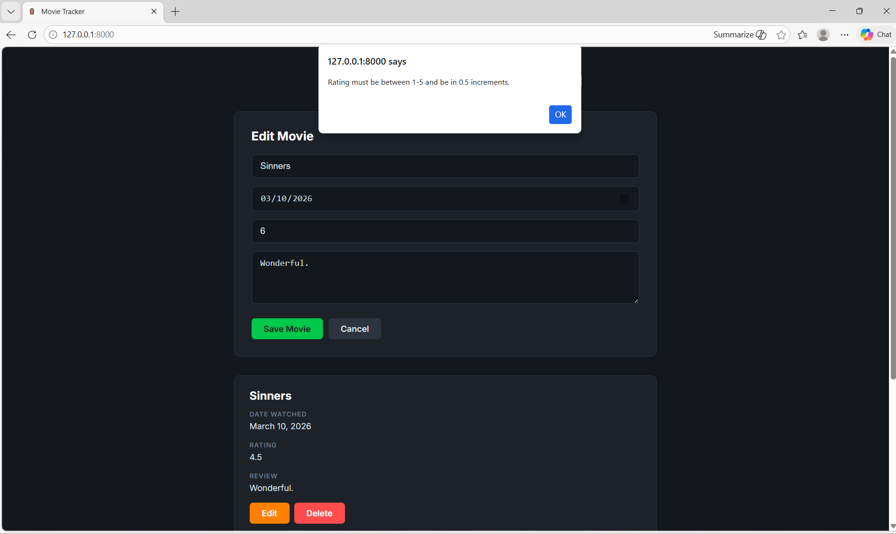
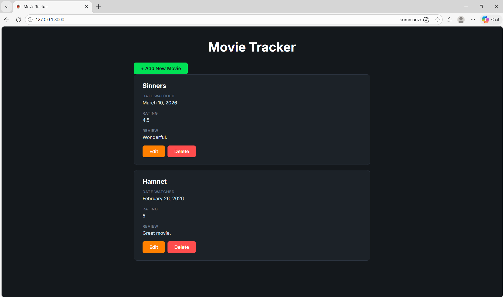
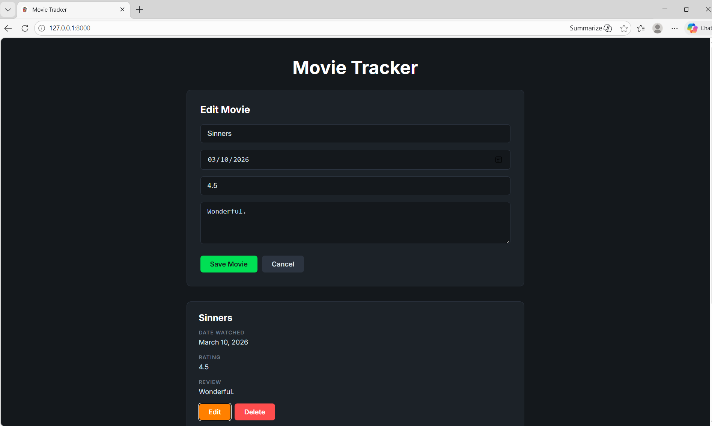
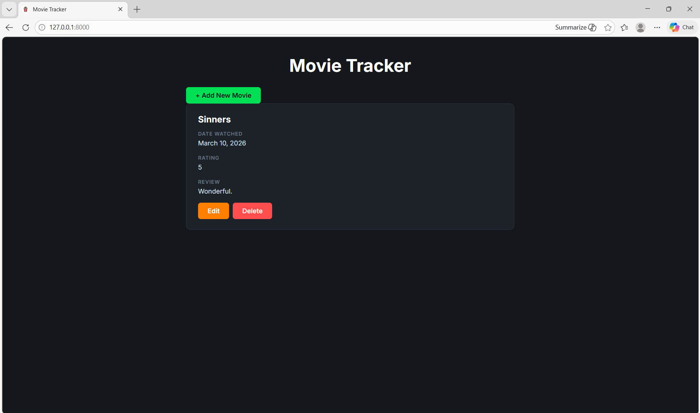

# Midterm Project: Movie Tracker

The following web application was built using FastAPI and HTML/JavaScript/CSS. It is a movie tracker that allows users to log what movies they've seen and provide details (date wathced, rating, review).

## Movie Tracker Web App

Users can:
- Add new movies with date watched, rating, and review
- Edit movies that have already been logged
- Delete movies that have been logged
- View logged movies

After setting up the virtual environment (```python -m venv venv```), activating it (```venv\Scripts\activate```) and installing/activating uvicorn, the web app can be accessed at:

```
http://127.0.0.1:8000
```

The terminal should look like this after uvicorn has been run:


The FastAPI docs are shown below:


Each movie contains 4 fields that the user can input: ```title```, ```date```, ```rating```, and ```review```.

## Frontend
```index.html``` is the main page structure that creates the movie tracker container and movie forms. ```style.css``` styles the look of the webpage, and AI was used to help get a "Letterboxd" theme. Lastly, ```main.js``` is the main file that communicates with the FastAPI backend through HTTP requests and is responsible for rendering the interface, managing the form state, and handling CRUD operations.

## Movie Tracker Images

Once the web page is opened, this is the initial page that pops up:


When " + Add New Movie" is selected, the following shows up:


Here the user will be prompted to input a movie title, the date the movie was watched, their rating, and their review. The date cannot be in the future, and the application will prevent the movie from being saved if a future date is selected.

Similarly, the rating of a movie must be between 1-5, and be in 0.5 increments. If an invalid rating is input, say 6, the validation will prevent it from being saved.


This is what the page looks like after 2 movies have been addded.


Once the orange "edit" button is selected, a user can edit their logged movie.


A user can also delete a movie by pressing the red "Delete" button. The following is what the list looks like after a movie has been deleted.


As a user is interacting with the app, the terminal looks something like this:


All of the external dependencies necessary for this project are recorded in the ```requirements.txt``` file.
